# What is state management in VueX? #

## 1. ##
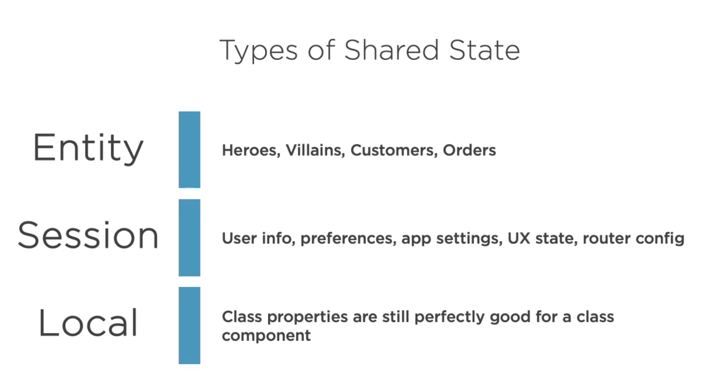

## 2. How do we share data using shared module? ##

- Shared module approach of sharing service is the common technique.

## 3.Sharing data using multiple modules ##
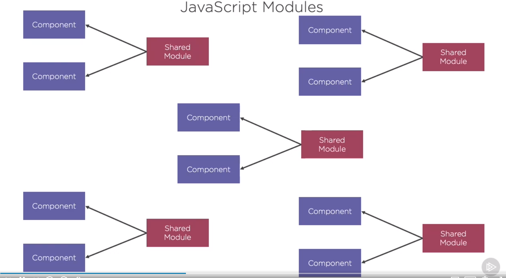

## 4. Drawback of sharing data using different module ##
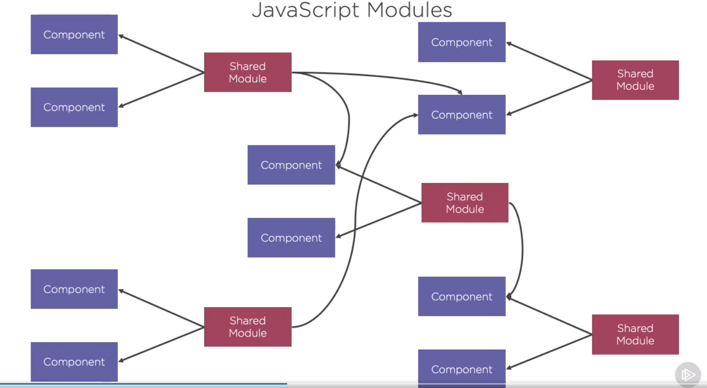

## 5. State is shared in many place and likely to be implemently incosistently ##
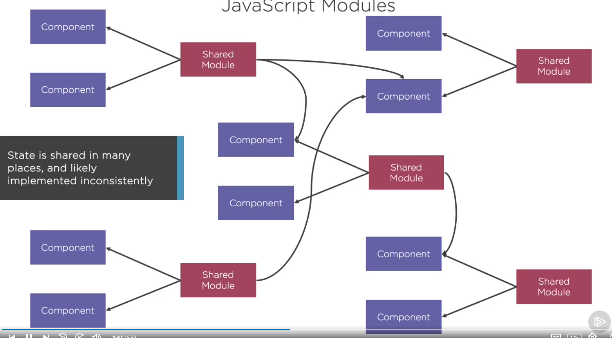

## 6. Overview of the single source of data used by VueX ##
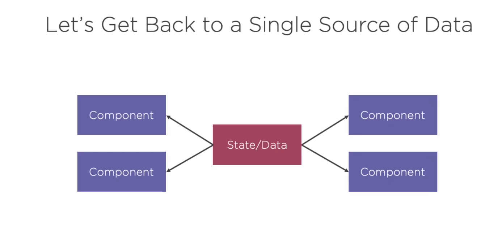

## 7.Dispatch in action ##

- Dispatch this action to get data from API server

## 8. Commits a mutation ##
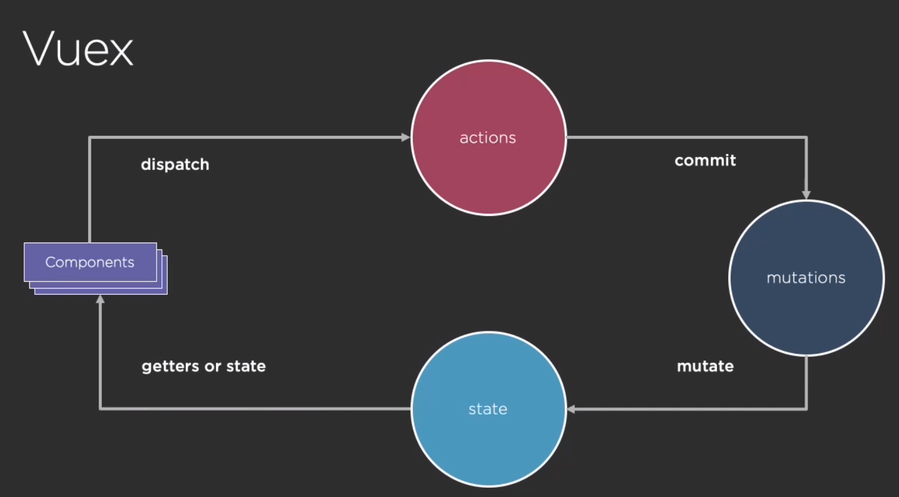
-  Once data is received from the API server then it commit mutation and changed state of the data

- Mutation means we are changing the state 

## 9. Get the state back in the component using getters or state ##
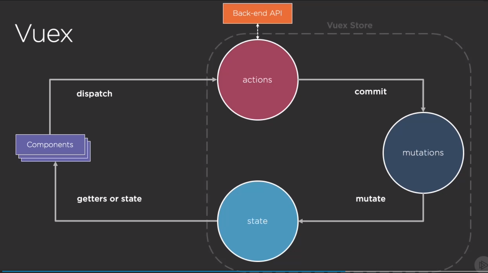

## 10. ##
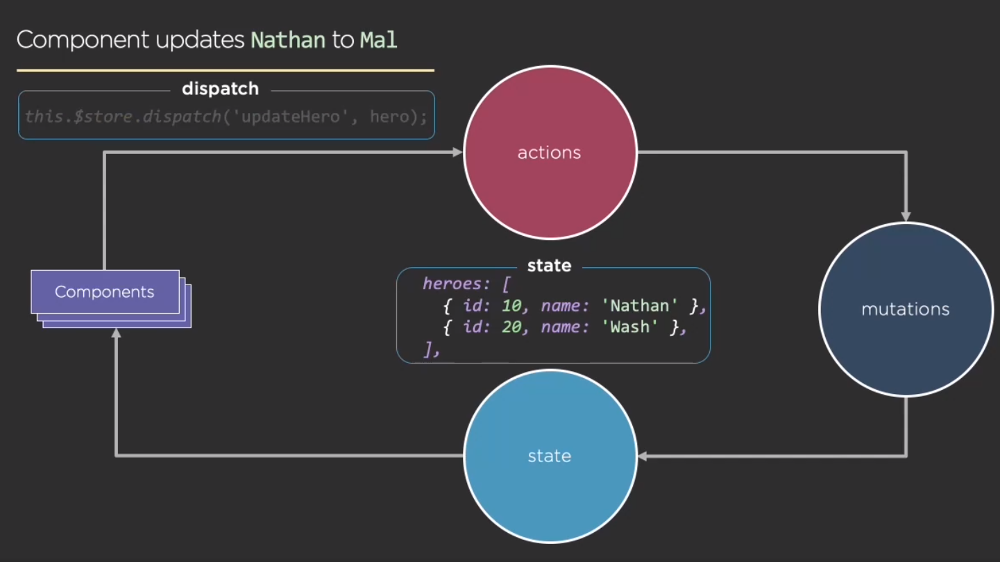

## 11. ##
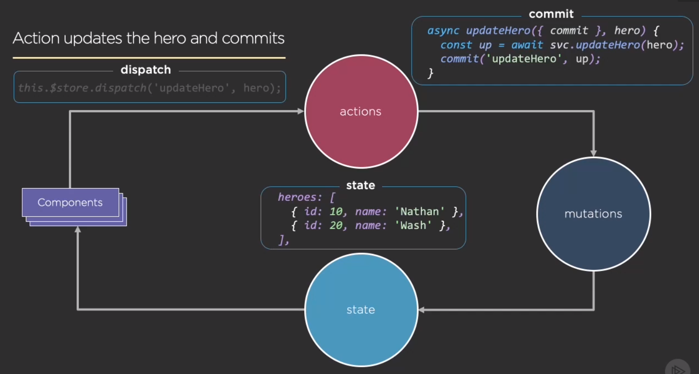

## 12. ##

## 13. ##
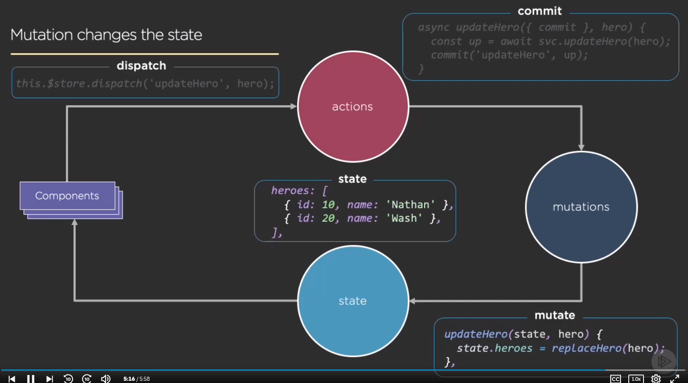

## 14. ##
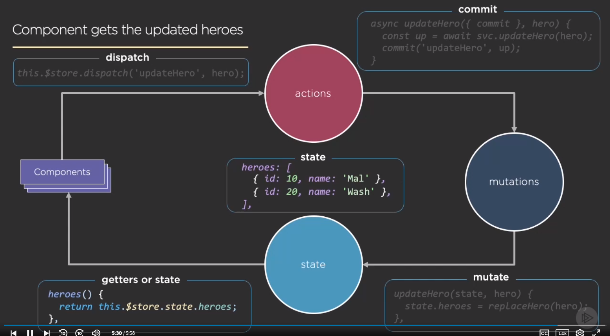

## 15. ##

