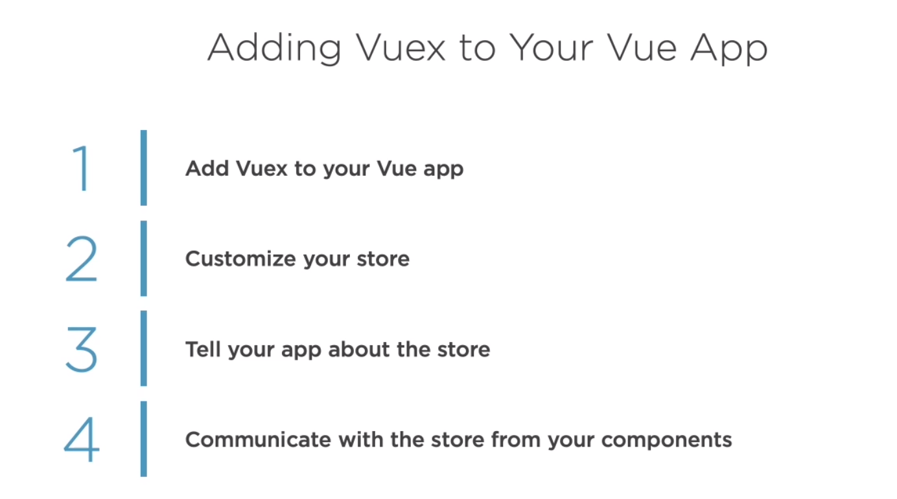
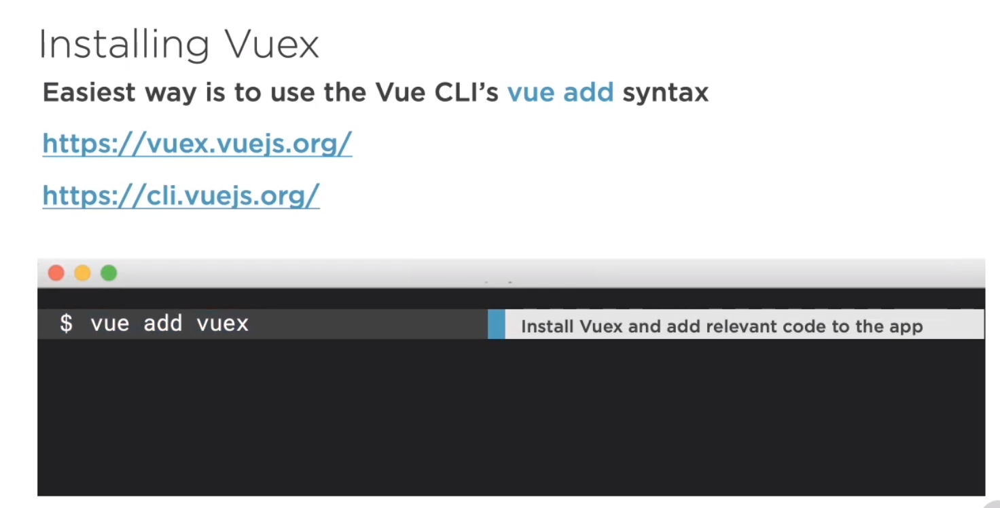
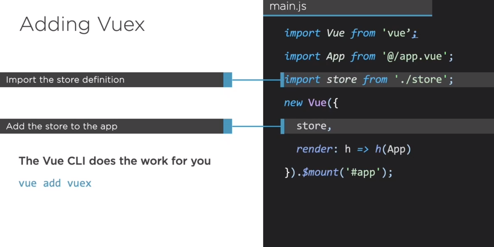
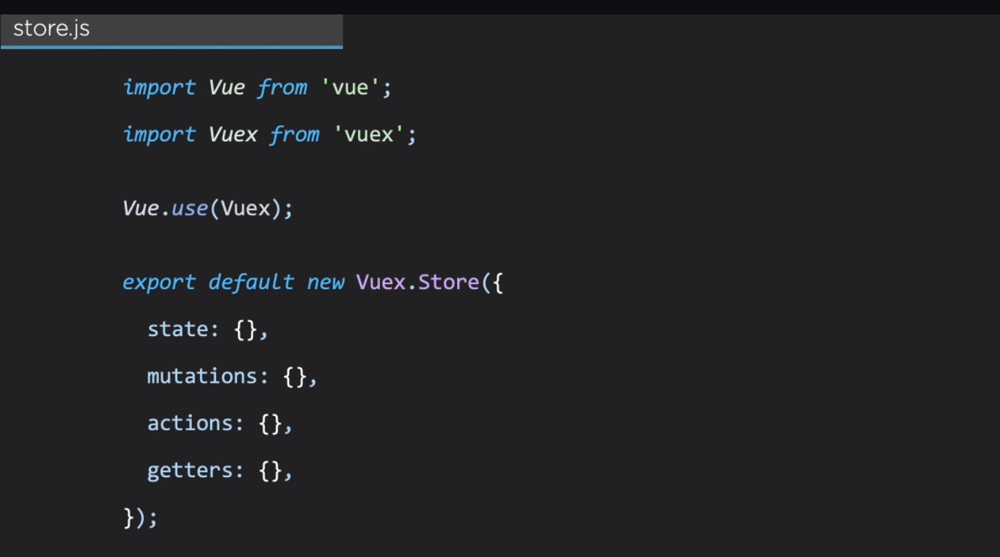
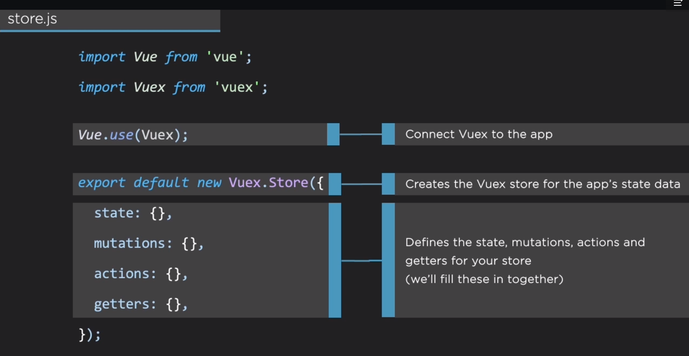

# 1. Overview of adding Vuex to the application? #

# 2. How to install Vuex in the application using npm? #

# 3. How to register Vuex to the mainJs? #

# 4. How to tell app about our store? #

# 5. Details about Store.Js? #
