# Describing state in VueJs #
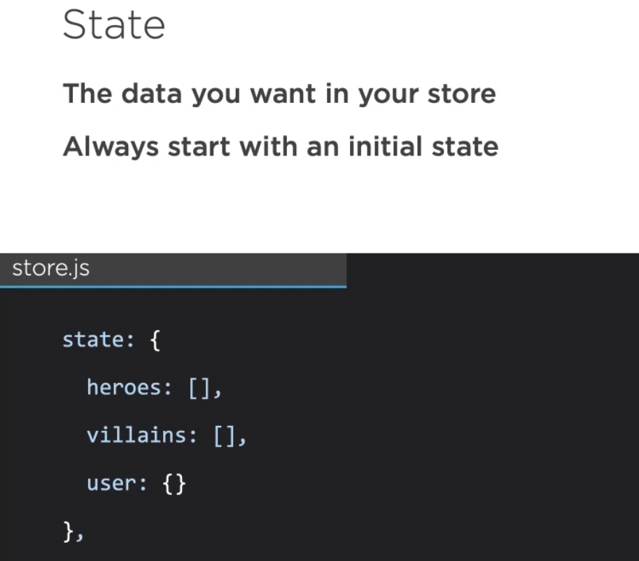

# 2. Create heros array inside the store #
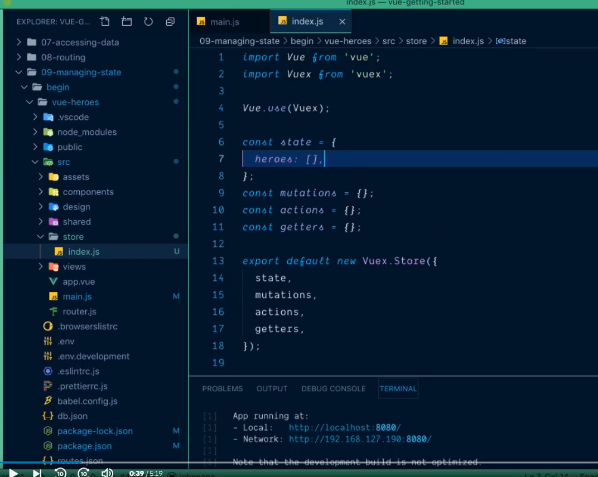

# 3. Let's connect this to the component #
- Goto Vue
- Go heros.vue
- Delete existing heros data
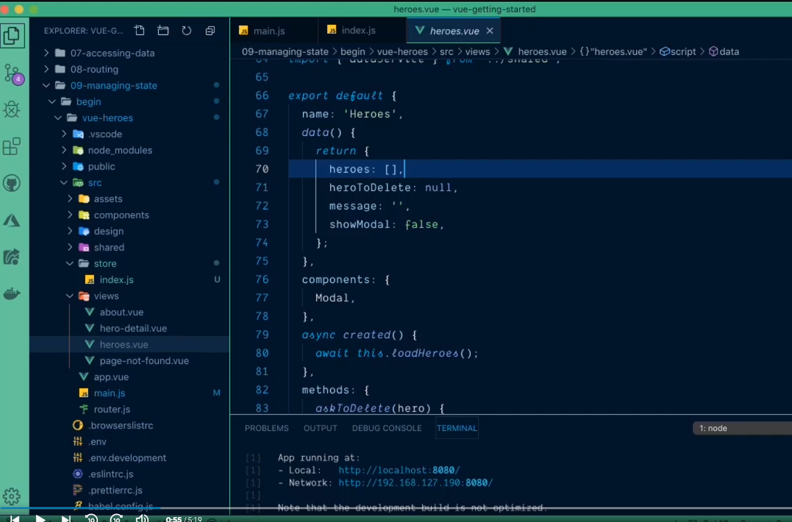

- inside the method where we are using heros data, get the heros from state
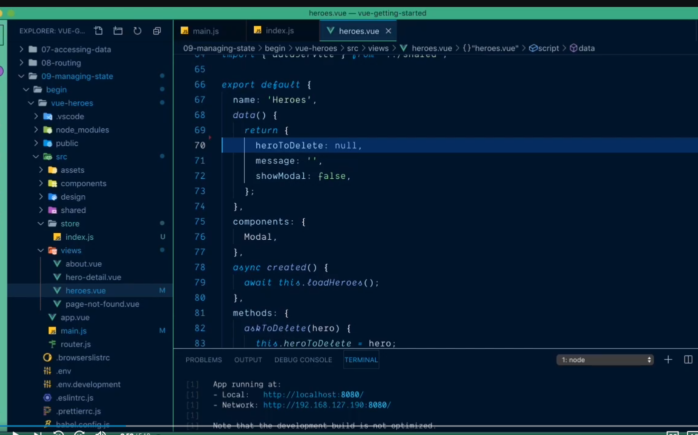
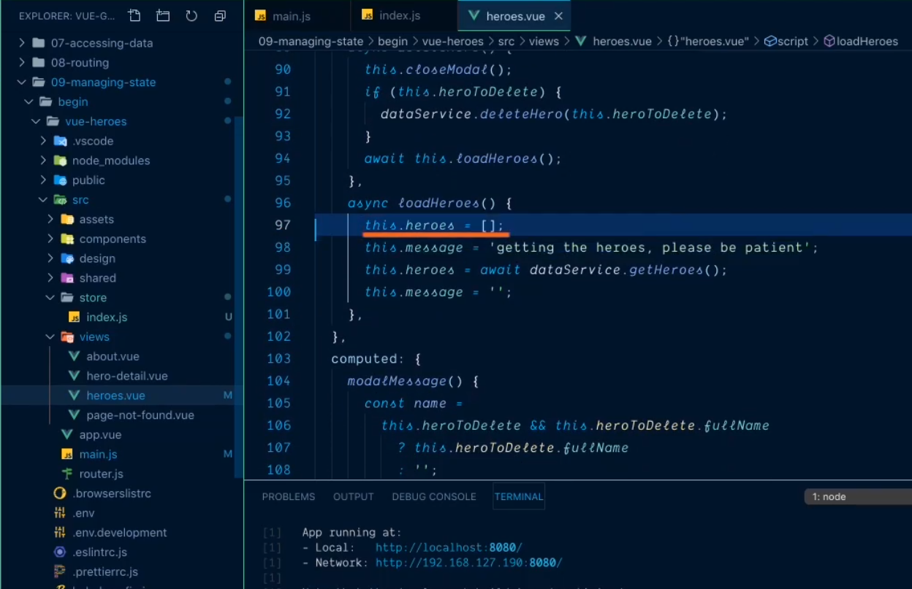
- But our local heros array is deleted so we can't do like 
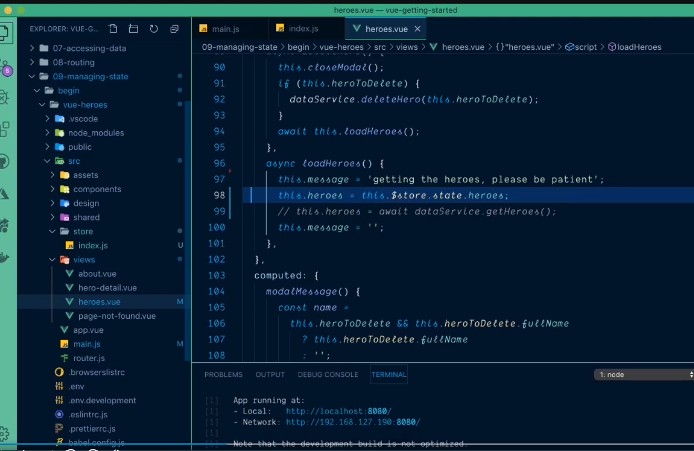

# 4. How to get heros from the state? #
- Create heros inside the computed
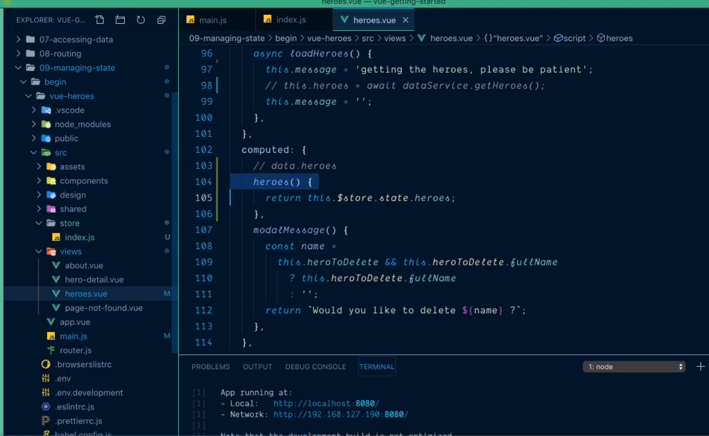

# 5. Add fake heros inside the state #
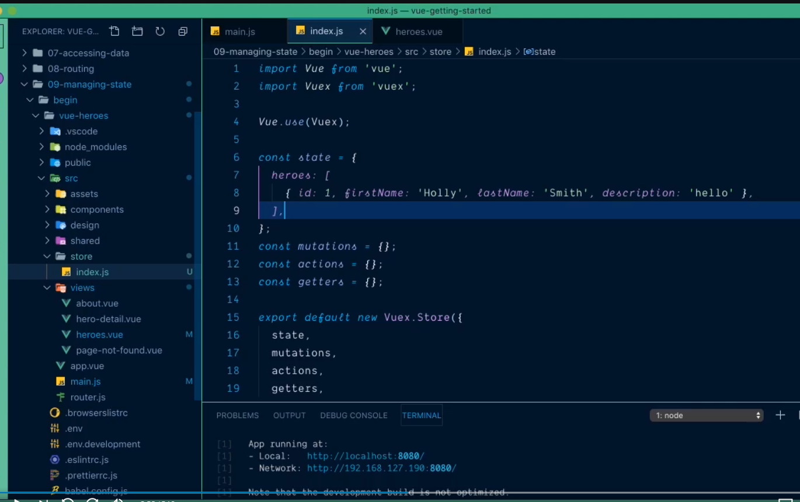

# 6. How to view state data using #
-Click on Vue
- Click on Switch to Vuex
- Click on Base State
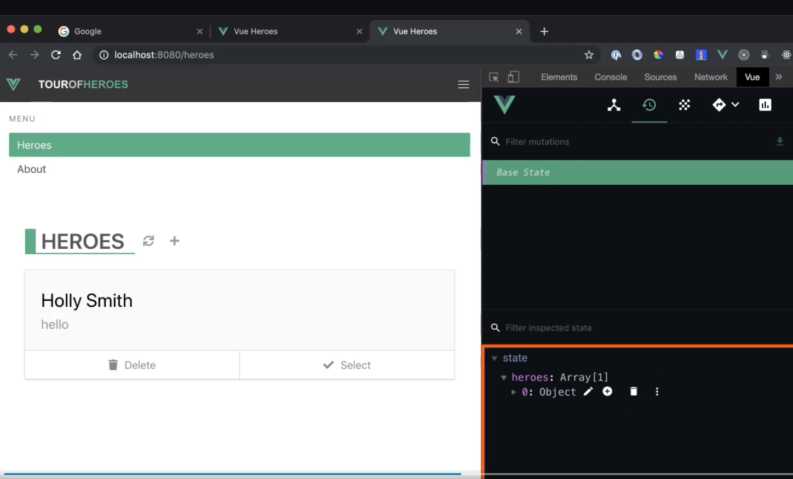

# Easier way to access data from state #
- Get heros
- accet function state
- Go get the state
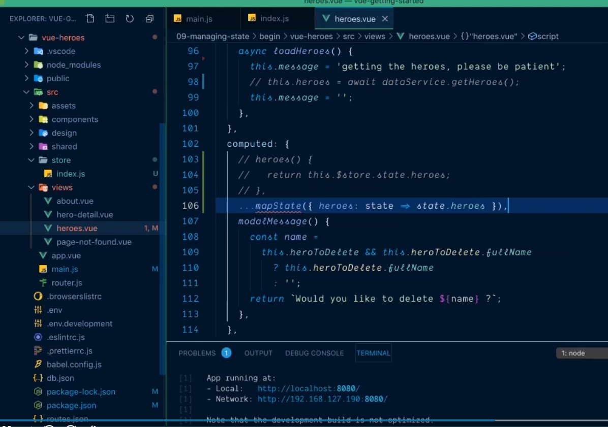

# More easier way to access data from state #
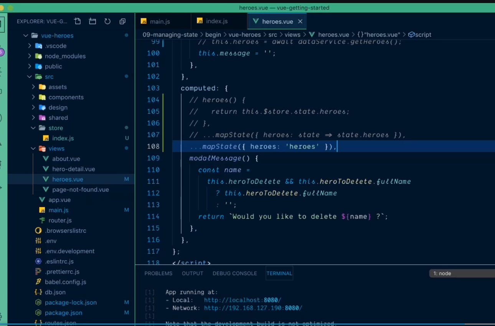

# One more easier way to access
