# Dispatching action to get the data #
- Once we do have state, we need to mutate the state to actually add the heros
- The only way we can mutate the state is through the mutation
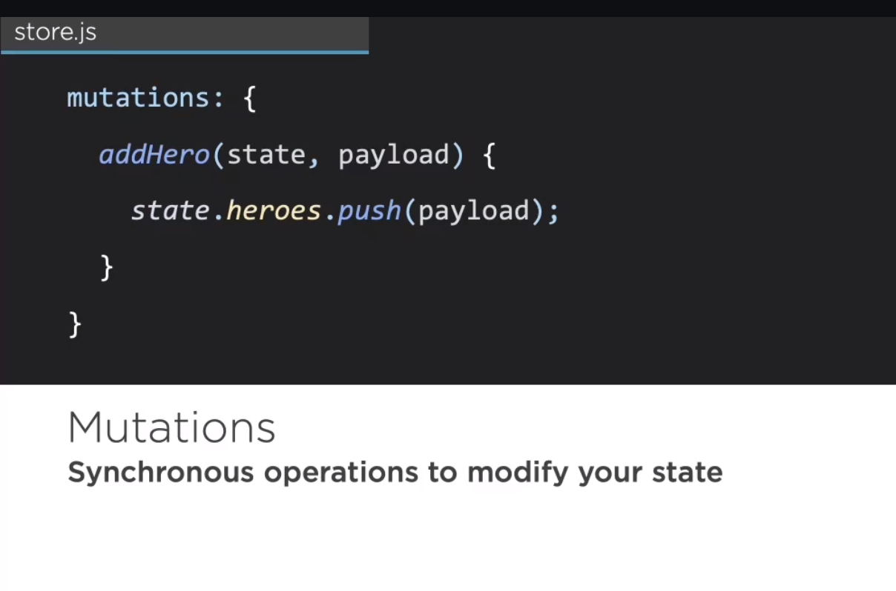

## How it works? ##
- imagine we do have function called that accepts state as first parameter and payload as the second parameter
- push it into the state

# Firing of the mutation #
- commit one or more mutation that we want
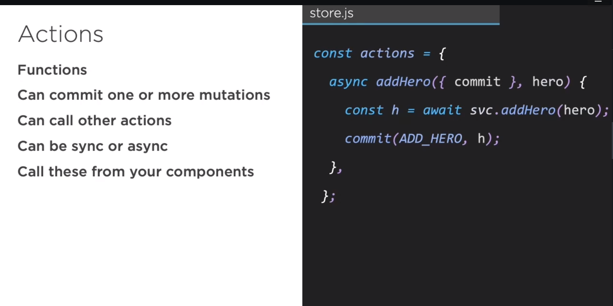

# Example #
- Create actions
- use existing dataservice for getting data
- commit local mutation and pass heros
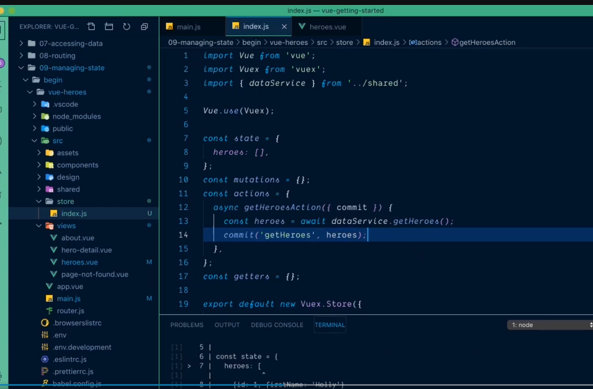

 # Create local mutation function inside mutations section #
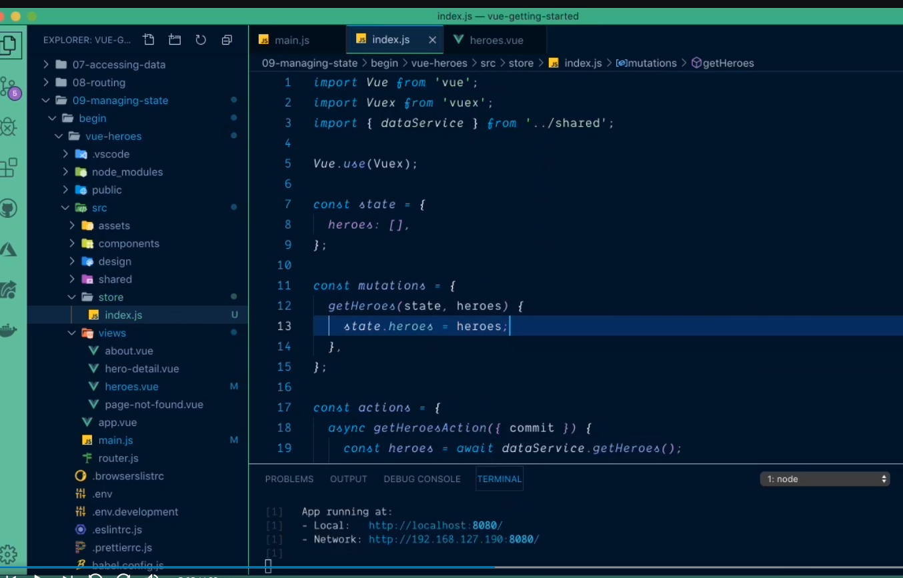

# Modify the code with standard constant #
- define constant inside 
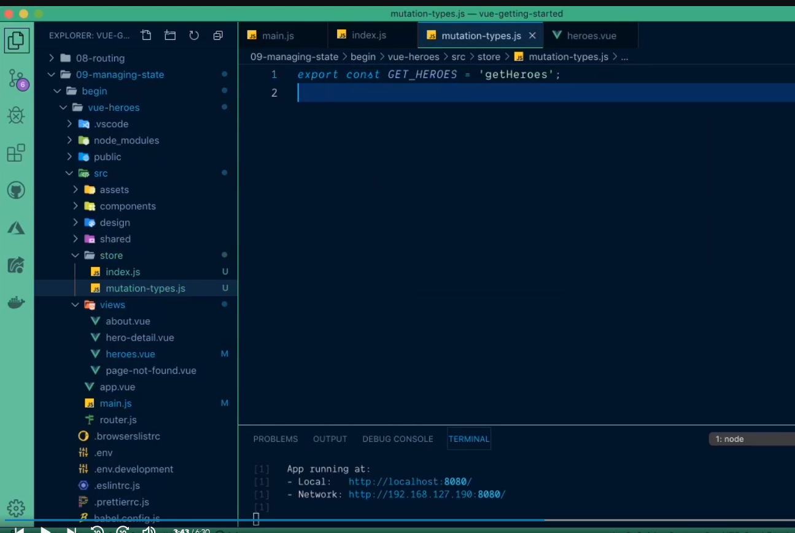

- Modfy store with newly created constant
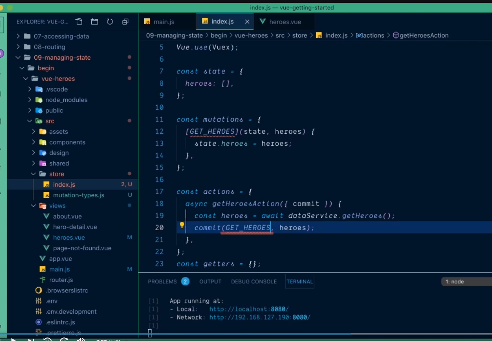
- We did this to use the same magic string inside store
- Now import constant
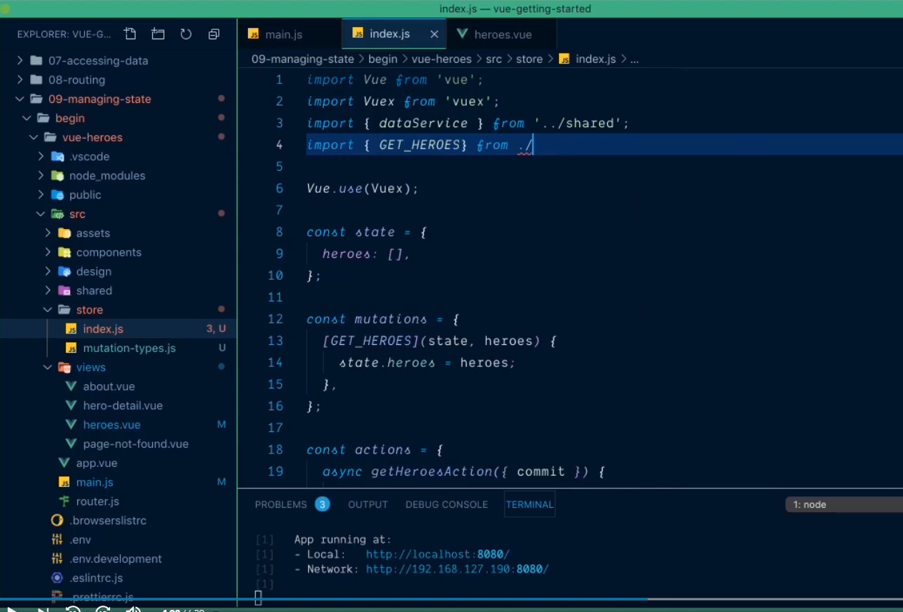

# Who is going to call the action? #
- In vueJs component 
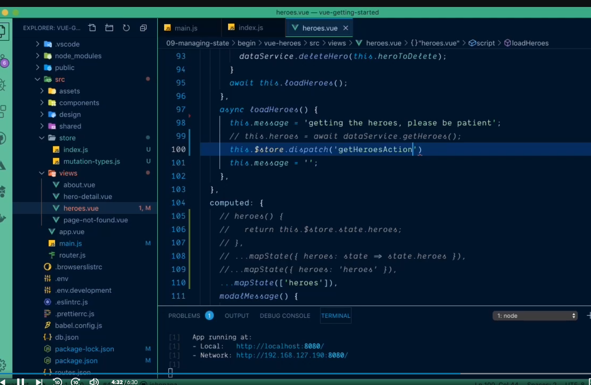

# There is better way to write this using helper function #
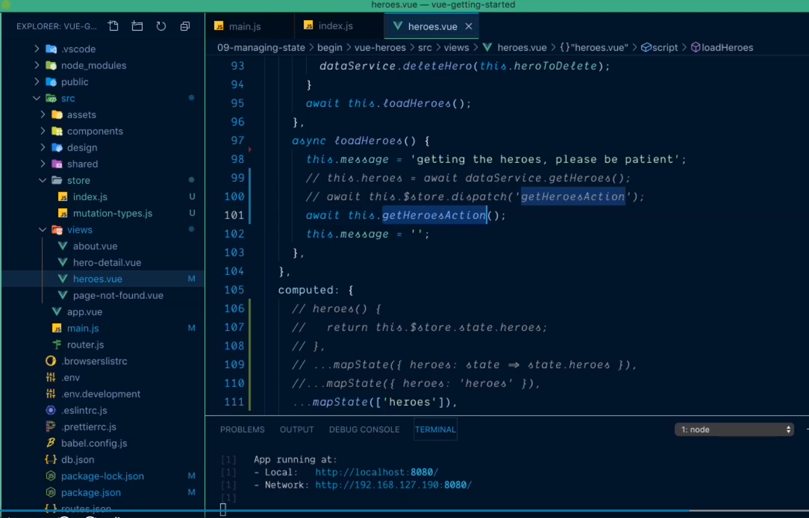

# Use mapAction #
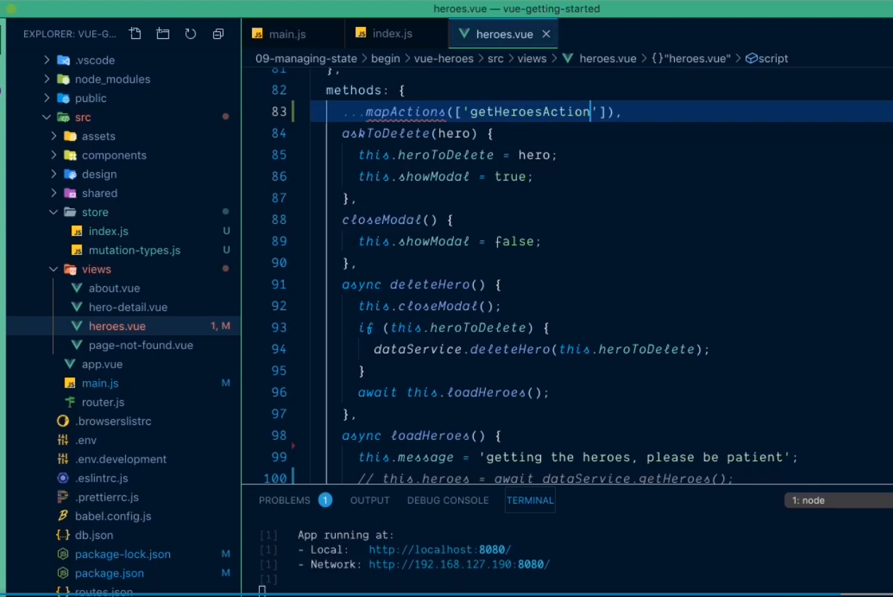

# Import mapAction #
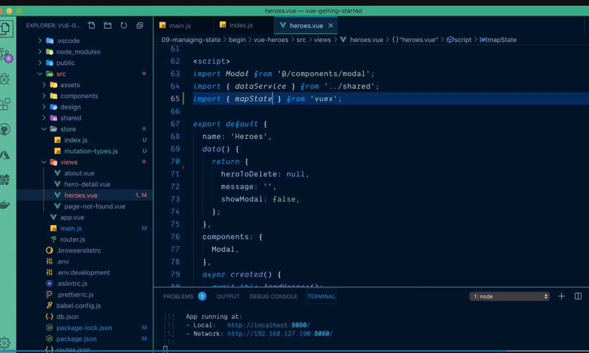