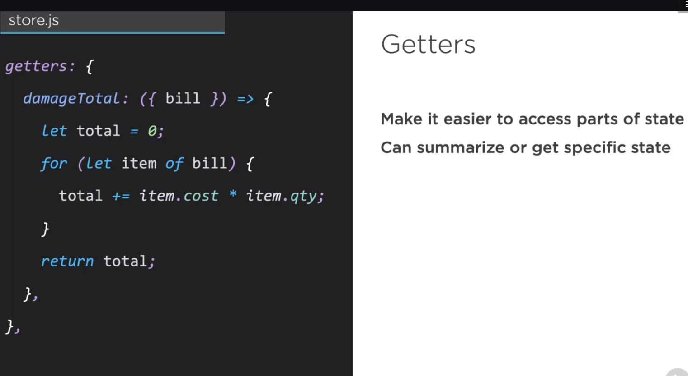
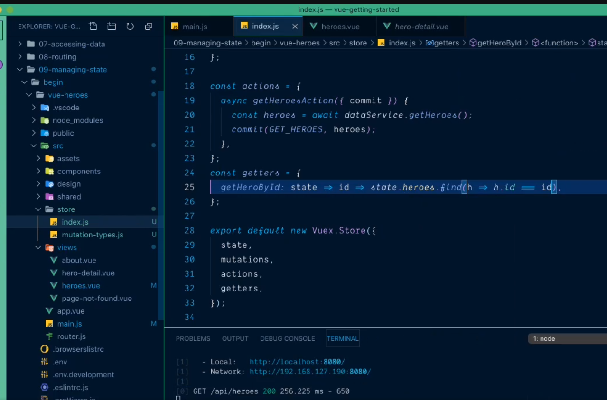
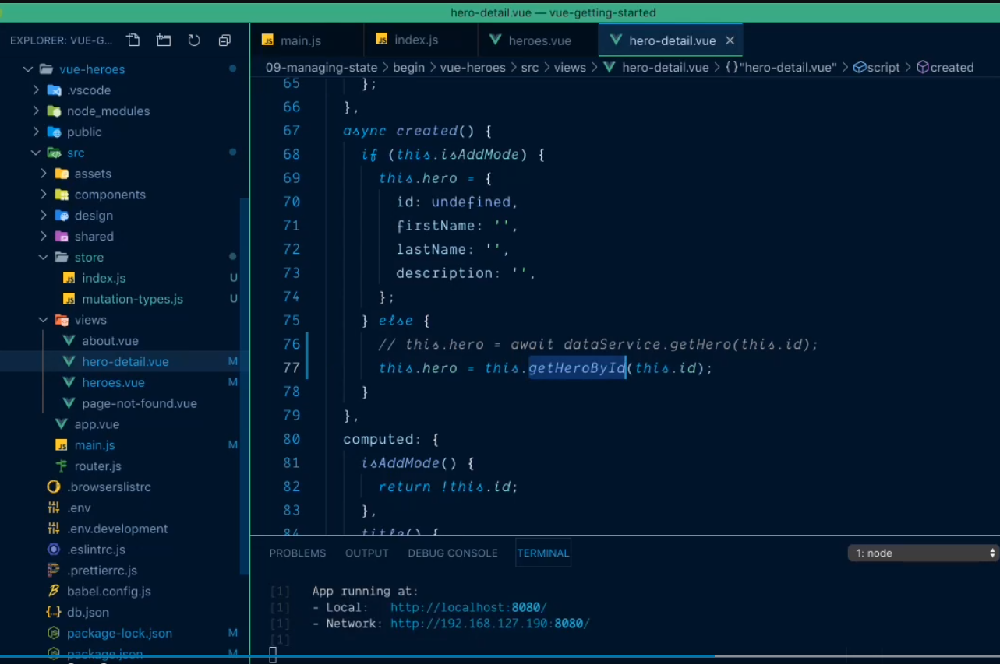
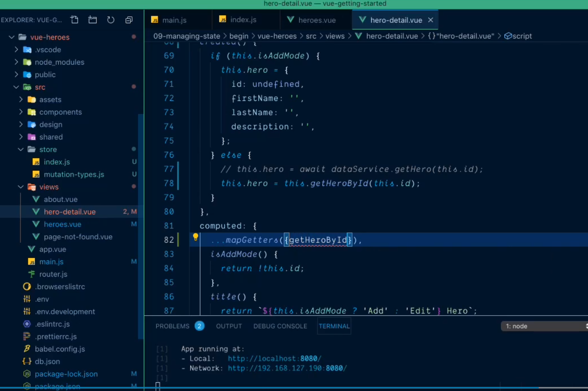
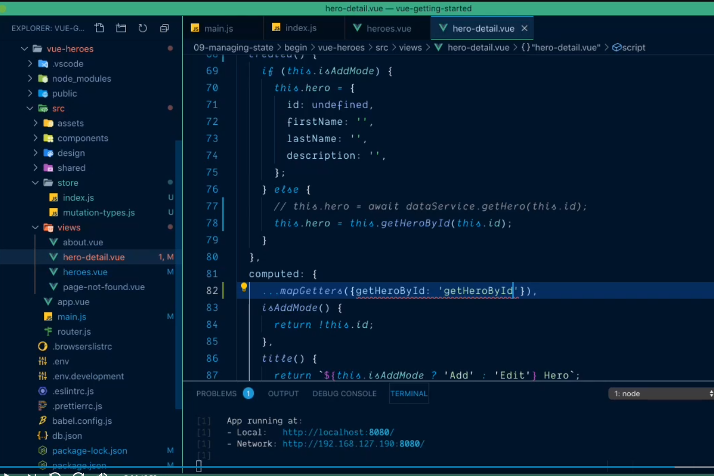
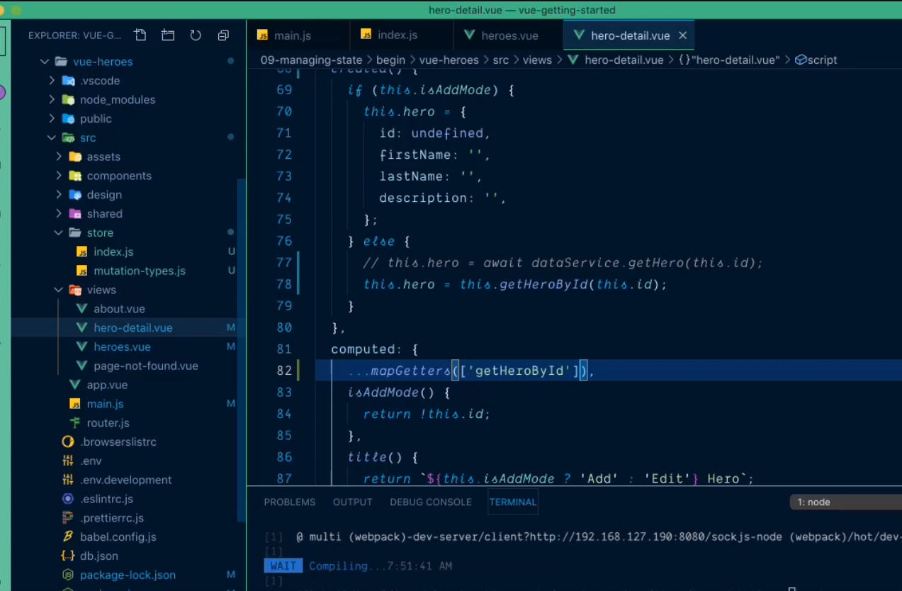

# Getting specific state using Getters #

- Let's say we do have state called bill
- we can computed the total cost and return bill

# Get single heros inside store #

- define function called getHeroById
- every function has state param
- add another param called id
- give me back from heros where id match 

# Bind it inside the component #

# Define helper method #
- Define map getters inside computed

