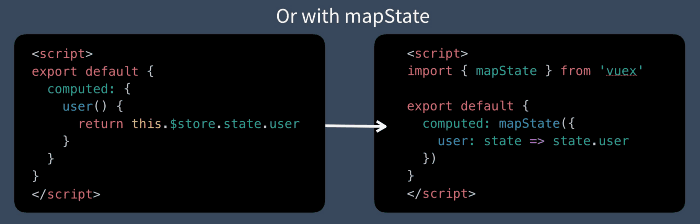

# 1. What is mapState helper ? #
Sooo…trying to figure out how to use VueX proficiently, and I’m a little stuck on mapState.

I get that I can have data in VueX, like so:

```js
state: {
   name: 'person'
}
```
…and access that piece of data in a .vue file component, like so:

```js
computed: {
    name () {
        return this.$tore.state.name
    }
}
```
But I have two or more separate pieces of data in a VueX store, like so:

```js
state: {
   name: 'person',
   age: 'nunya business'
}
```
…I would need to have a separate computed property for age as well, like so:

```js
computed: {
    name () {
        return this.$tore.state.name
    },
    age () {
        return this.$tore.state.age
    }
}
```
…which will get verbose fast as more pieces of data are added to the computed pile.

## 1.1 how to use statemep ##
Could I do this:
```js
computed: {
  ...mapState('module/authors', ['name', 'age', 'job']);
  ...mapState('module/articles', ['title', 'subtitle', 'image'])
}
```
…to then be able to do this:

```js
<template>

    <h1>{{ article.title }}</h1>

    <p>{{ author.name }}</p>

    etc...

</template>
```

## 1.2 how to use statemap ##

<br/>

<br/>


# 2. Eg #
```js

ProductListOne.vue

<template>
  <div id="product-list-one">
    <div><b>This is product list one</b></div>
    
    <ul>
        <li v-for="product in products" v-bind:key="product"> 
          {{product.name}}
          {{product.qtn}}
          </li>
    </ul>

  </div>
</template>

<script>

export default {
  computed: {
    ...mapState(['products'])
  }
}
</script>
```

```js

ProductListTwo.vue

<template>
  <div id="product-list-two">
      <div><b>This is product list two</b></div>
       <ul>
        <li v-for="product in products" v-bind:key="product"> 
          {{product.name}}
          {{product.qtn}}
          </li>
    </ul>
  </div>
</template>

<script>
export default {
   computed: {
    ...mapState(['products'])
  }

}
</script>
```