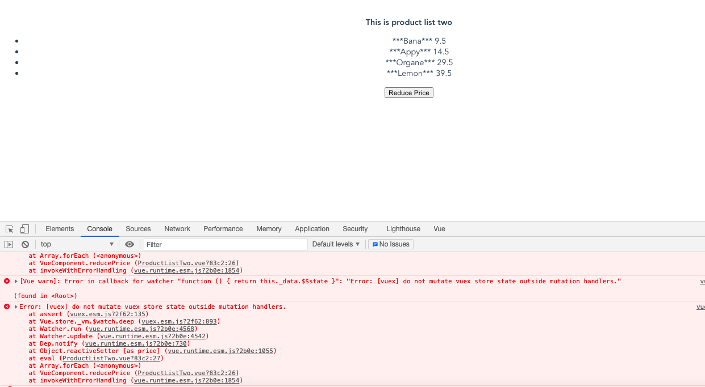

# How to use mutation in Vuex #

```js

store.js

import Vue from 'vue';
import Vuex from 'vuex';

Vue.use(Vuex);

export const store = new Vuex.Store({
    state: {
      products:[
        {name:'Bana', price:20},
        {name:'Appy',price:30},
        {name:'Organe',price:60},
        {name:'Lemon',price:80}
      ]
    },
    getters: {
      saleProducts: state => {
        var saleProduct=state.products.map(product =>{
          return {
            name: '***'+product.name+'***',
            price: product.price/2
          }
        })
        return saleProduct;
      }
    }
  });
  ```

  ```js

  ProductListTwo.vue

  <template>
  <div id="product-list-two">
    <div><b>This is product list two</b></div>
    
    <ul>
        <li v-for="product in saleProducts" v-bind:key="product"> 
          {{product.name}} &nbsp; &nbsp;
          {{product.price}}
          </li>
    </ul>

    <button v-on:click="reducePrice">Reduce Price </button>

  </div>
</template>

<script>
import { mapGetters } from 'vuex'

export default {
  computed: {
    ...mapGetters(['saleProducts'])
  },
  methods: {
    reducePrice: function() {
      this.$store.state.products.forEach(product => {
        product.price -= 1;
      })
    }
  },
}
</script>
```

## Drawbacks ##
- not able to find the state of the data


### Special case if we make ###
```js

store.js

import Vue from 'vue';
import Vuex from 'vuex';

Vue.use(Vuex);

export const store = new Vuex.Store({
    strict:true,
    state: {
      products:[
        {name:'Bana', price:20},
        {name:'Appy',price:30},
        {name:'Organe',price:60},
        {name:'Lemon',price:80}
      ]
    },
    getters: {
      saleProducts: state => {
        var saleProduct=state.products.map(product =>{
          return {
            name: '***'+product.name+'***',
            price: product.price/2
          }
        })
        return saleProduct;
      }
    }
  });

```



# How to solve this issue #

```js

ProductListTwo.vue

<template>
  <div id="product-list-two">
    <div><b>This is product list two</b></div>
    
    <ul>
        <li v-for="product in saleProducts" v-bind:key="product"> 
          {{product.name}} &nbsp; &nbsp;
          {{product.price}}
          </li>
    </ul>

    <button v-on:click="reducePrice">Reduce Price </button>

  </div>
</template>

<script>
import { mapGetters } from 'vuex'

export default {
  computed: {
    ...mapGetters(['saleProducts'])
  },
  methods: {
    reducePrice: function() {
      this.$store.commit('reducePrice');
    }
  },
}
</script>
```

```js

store.js

import Vue from 'vue';
import Vuex from 'vuex';

Vue.use(Vuex);

export const store = new Vuex.Store({
    strict:true,
    state: {
      products:[
        {name:'Bana', price:20},
        {name:'Appy',price:30},
        {name:'Organe',price:60},
        {name:'Lemon',price:80}
      ]
    },
    getters: {
      saleProducts: state => {
        var saleProduct=state.products.map(product =>{
          return {
            name: '***'+product.name+'***',
            price: product.price/2
          }
        })
        return saleProduct;
      }
    },
    mutations: {
      reducePrice: state=> {
        state.products.forEach(product => {
          product.price -= 1;
        })
      }
    }
  
  });
  ```